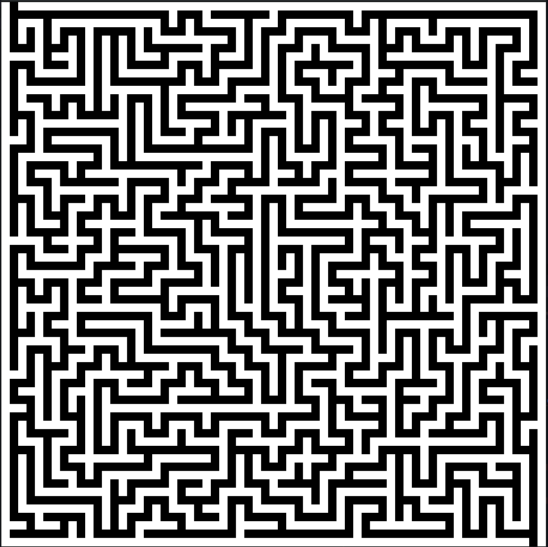
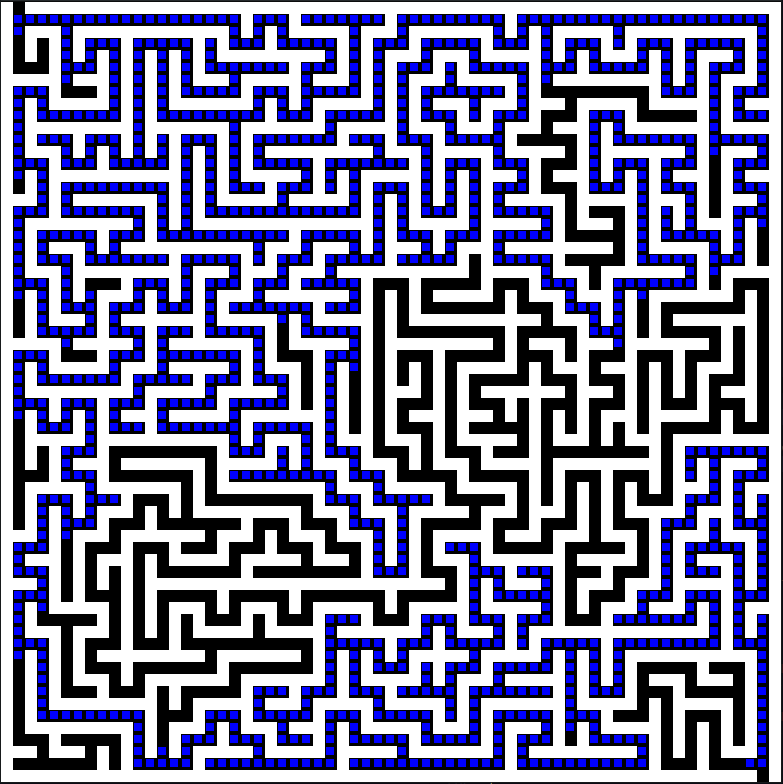

# Depth First Search Maze-Generator

This was created with the intent to visualise depth first search.
It creates a maze using a randomised depth first search and explores the maze until it finds the exit also using depth first seach.

Window management and rendering are handled using [SDL2](https://www.libsdl.org/)

### Usage and Controls
A maze is generated on launch.
The e key explores the maze and displays where it has explored.
The r key creates a new maze.

### Example maze

### Example after exploration

